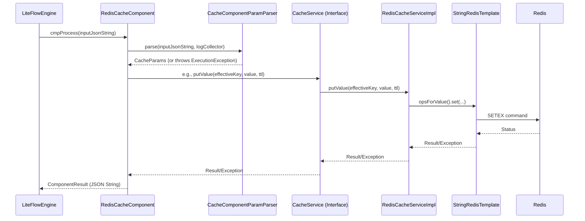

# Technical Design Document: Redis Cache Component for LiteFlow

## 1. Functional Requirements

The Redis Cache Component for LiteFlow aims to provide flexible caching capabilities accessible as a component within LiteFlow process definitions. It supports two primary modes of operation: Single Value Mode and List (ZSET) Mode.

**1.1. Single Value Mode:**
    *   **`SINGLE_WRITE`**: Store a single string value associated with a key.
        *   Supports an optional Time-To-Live (TTL) for the cached item.
        *   Supports an optional key suffix for namespacing or further categorization.
    *   **`SINGLE_READ`**: Retrieve a single string value based on a key.
        *   Supports an optional key suffix.

**1.2. List (ZSET) Mode (Sorted Set based):**
    *   **`ZSET_OVERWRITE`**: Overwrite a list (stored as a Redis ZSET) with a new set of string values. All items in the list share the same score (timestamp of write).
        *   Supports an optional TTL for the list.
        *   Supports an optional key suffix.
        *   Supports a maximum number of elements to retain; throws an error if the input list exceeds this and `maxElements` is positive.
    *   **`ZSET_ADD`**: Add a new string value to an existing list (ZSET) with a specified score.
        *   If the list size exceeds a configured maximum (`maxElements`), the oldest items (by rank, not score) are trimmed.
        *   Supports an optional TTL that is refreshed on add.
        *   Supports an optional key suffix.
    *   **`ZSET_READ_ALL`**: Retrieve all string values from a list (ZSET), ordered by score (typically newest first based on reverse range).
        *   Supports an optional key suffix.
    *   **`ZSET_READ_CONDITIONAL`**: Retrieve string values from a list (ZSET) where the score (timestamp) is greater than or equal to a given `conditionTimestamp`.
        *   Supports an optional key suffix.
    *   **`ZSET_CHECK_EXIST`**: Check if a specific string value exists within a list (ZSET).
        *   Supports an optional key suffix.

**1.3. General Requirements:**
    *   All operations require a base `key`, `appId`, and `cacheName` to construct the final effective Redis key (e.g., `appId:cacheName:key:keySuffix`).
    *   The component must handle errors gracefully, logging issues and returning appropriate error responses or throwing exceptions.
    *   Input parameters are provided as a JSON string, which needs parsing and validation.
    *   The component output for read operations should be structured, indicating success and containing the requested data. For write operations, a success indication is sufficient.

## 2. Component Model Design (Core Protocol)

**2.1. Overview**

The Redis Cache Component is designed to integrate with the LiteFlow engine, allowing flow definitions to interact with a Redis cache for storing and retrieving data. It acts as a bridge between the LiteFlow execution context and a Redis backend, abstracting Redis-specific commands and providing a standardized interface for cache operations.

**2.2. Key Classes and Enums**

*   **`RedisCacheComponent`**:
    *   **Role**: The main LiteFlow component class (`NodeComponent`). It's the entry point for executing cache operations triggered by a LiteFlow process.
    *   **Key Responsibilities**:
        *   Receives input parameters (as a JSON string) from the LiteFlow engine.
        *   Delegates parsing and validation of input to `CacheComponentParamParser`.
        *   Constructs the `effectiveKey` for Redis using `appId`, `cacheName`, `key`, and `keySuffix`.
        *   Orchestrates the cache operation by calling the appropriate method on the `CacheService` based on `CacheType` and `CacheOperation`.
        *   Handles exceptions and formats the output as a `ComponentResult` JSON string.

*   **`CacheParams`**:
    *   **Purpose**: A Data Transfer Object (DTO) that holds all parsed and validated parameters required for a cache operation.
    *   **Key Fields**:
        *   `appId`, `cacheName`: For building the Redis key prefix.
        *   `type`: `CacheType` (SINGLE, ZSET).
        *   `key`: The primary identifier for the cache entry.
        *   `keySuffix`: Optional suffix for the cache key.
        *   `operation`: `CacheOperation` (e.g., SINGLE_WRITE, ZSET_ADD).
        *   `value`: Single string value (for SINGLE_WRITE, ZSET_ADD, ZSET_CHECK_EXIST).
        *   `values`: List of objects (for ZSET_OVERWRITE, parsed from JSON string).
        *   `ttlSeconds`: Time-to-live in seconds. Defaults if not provided or invalid.
        *   `maxElements`: Maximum number of elements for ZSETs. Defaults if not provided or invalid.
        *   `conditionTimestamp`: Timestamp for `ZSET_READ_CONDITIONAL`.
        *   `score`: Score for `ZSET_ADD`.

*   **`CacheService` (Interface)**:
    *   **Importance**: Defines the contract for all cache operations. This abstraction allows `RedisCacheComponent` to be decoupled from the specific cache implementation (e.g., Redis).
    *   **Methods**:
        *   `putValue(String key, String value, long ttlSeconds)`
        *   `getValue(String key)`
        *   `putList(String key, List<Object> items, long ttlSeconds, int maxSize)`
        *   `appendToList(String key, Object item, double score, long ttlSeconds, int maxSize)`
        *   `getList(String key)`
        *   `getListSince(String key, long sinceTimestamp)`
        *   `containsInList(String key, Object item)`
        *   `delete(String key)`
        *   `exists(String key)`

*   **`RedisCacheServiceImpl`**:
    *   **Role**: The concrete implementation of `CacheService` that interacts with a Redis data store using `StringRedisTemplate`.
    *   **Key Responsibilities**: Translates `CacheService` method calls into specific Redis commands (e.g., `SETEX` for `putValue`, `ZADD` for `appendToList`). Handles Redis-specific exceptions and wraps them in `ExecutionException` if necessary. Uses `SessionCallback` for transactional operations.

*   **`CacheType` (Enum)**:
    *   **Values and Meaning**:
        *   `SINGLE`: Represents operations on a single string value.
        *   `ZSET`: Represents operations on a list of values, implemented using Redis Sorted Sets (ZSETs) to allow for ordering (by score, typically timestamp) and efficient conditional retrieval.

*   **`CacheOperation` (Enum)**:
    *   **Values, Descriptions, and Associated `CacheType`**:
        *   `SINGLE_WRITE` (SINGLE): Store/overwrite a single value.
        *   `SINGLE_READ` (SINGLE): Read a single value.
        *   `ZSET_OVERWRITE` (ZSET): Replace an entire list with new items, all having the same score (timestamp).
        *   `ZSET_ADD` (ZSET): Add an item with a specific score to a list, with trimming.
        *   `ZSET_READ_ALL` (ZSET): Read all items from a list.
        *   `ZSET_READ_CONDITIONAL` (ZSET): Read items from a list meeting a score (timestamp) condition.
        *   `ZSET_CHECK_EXIST` (ZSET): Check if an item exists in a list.

*   **`ComponentResult`**:
    *   **Structure**: A simple DTO (serialized to JSON) representing the outcome of the component's execution.
        *   `success` (boolean): Indicates if the operation was successful.
        *   `message` (String): A message, typically "Success" or an error description.
        *   `data` (Object): The data returned by read operations.
    *   **`data` Variation**:
        *   `SINGLE_READ`: Contains the string value or `null`.
        *   `ZSET_READ_ALL`, `ZSET_READ_CONDITIONAL`: Contains a `List<String>`.
        *   `ZSET_CHECK_EXIST`: Contains a `Boolean`.
        *   Write operations: `data` is often `null`.

*   **`CacheComponentParamParser`**:
    *   **Role**: A utility class responsible for parsing the input JSON string into a `CacheParams` object.
    *   **Key Responsibilities**:
        *   Validates the presence of required fields (`type`, `key`, `operation`, `appId`, `cacheName`, and contextually required fields like `value` or `conditionTimestamp`).
        *   Parses string representations of enums (`CacheType`, `CacheOperation`) into their respective enum types, handling case-insensitivity and invalid values.
        *   Validates that the requested `CacheOperation` is compatible with the specified `CacheType`.
        *   Parses numeric types (`ttlSeconds`, `maxElements`, `conditionTimestamp`, `score`), applying defaults for optional numeric fields if they are missing or invalid.
        *   Parses the `value` field for `ZSET_OVERWRITE` from a JSON array string into a `List<Object>`.
        *   Throws `ExecutionException` if validation fails, providing informative error messages.

**2.3. Design Rationale**

*   **Extensibility**:
    *   **`CacheService` Interface**: Decouples the component logic from the Redis implementation. A new cache backend (e.g., Memcached, Hazelcast) could be introduced by providing a new implementation of `CacheService` without changing `RedisCacheComponent` or `CacheParams`.
    *   **Enums (`CacheType`, `CacheOperation`)**: Adding new cache types or operations involves extending these enums and updating the `switch` statements in `RedisCacheComponent` and the validation logic in `CacheComponentParamParser`. The service interface would also need new methods.
    *   **`CacheParams` DTO**: New parameters can be added to `CacheParams` to support new features, with parsing logic updated in `CacheComponentParamParser`.

*   **Clarity and Maintainability**:
    *   **Naming Conventions**: Clear and consistent naming for classes, methods, and variables (e.g., `CacheType`, `SINGLE_WRITE`, `putValue`) makes the code easier to understand.
    *   **Separation of Concerns**:
        *   `CacheComponentParamParser`: Handles all input parsing and validation, keeping `RedisCacheComponent` cleaner.
        *   `RedisCacheComponent`: Focuses on orchestration and LiteFlow integration.
        *   `CacheService` / `RedisCacheServiceImpl`: Encapsulates the actual cache interaction logic.
    *   **DTOs (`CacheParams`, `ComponentResult`)**: Provide structured data transfer, improving readability and reducing method signature complexity.
    *   **Enums**: Centralize and type-safely define the kinds of cache types and operations, preventing errors from string misspellings.

*   **Robustness**:
    *   **Error Handling**: Consistent use of `ExecutionException` for known error conditions (parsing failures, validation errors, cache operation failures) allows the LiteFlow engine to handle component failures uniformly. Unexpected exceptions are wrapped into `ExecutionException`.
    *   **Parameter Validation**: `CacheComponentParamParser` performs thorough validation of required fields, enum values, type/operation compatibility, and data formats, preventing invalid data from reaching the service layer.
    *   **Default Values**: Optional parameters like `ttlSeconds` and `maxElements` have defined default values, making the component more resilient to incomplete inputs for write operations.
    *   **Atomic Operations**: For Redis operations that need to be atomic (like `putList` and `appendToList`), `SessionCallback` is used to ensure all commands within the transaction either succeed or fail together.

## 3. Core Pseudocode

**3.1. `RedisCacheComponent.cmpProcess`**:
```pseudocode
function cmpProcess(inputJsonString): // Input is a JSON string
    try:
        // logCollector is available to the parser and component
        params = CacheComponentParamParser.parse(inputJsonString, logCollector)
        effectiveKey = params.getAppId() + ":" + params.getCacheName() + ":" + params.getKey()
        if params.getKeySuffix() is not empty:
            effectiveKey = effectiveKey + ":" + params.getKeySuffix()

        log "Processing " + params.getOperation() + " for effective key: " + effectiveKey

        resultData = null
        message = "Success"

        switch (params.getType()):
            case SINGLE:
                switch (params.getOperation()):
                    case SINGLE_WRITE:
                        cacheService.putValue(effectiveKey, params.getValue(), params.getTtl())
                        // resultData remains null for success acknowledgement
                        break
                    case SINGLE_READ:
                        resultData = cacheService.getValue(effectiveKey)
                        break
                    default:
                        throw new ExecutionException("Unsupported operation " + params.getOperation() + " for SINGLE type")
                break
            case ZSET:
                switch (params.getOperation()):
                    case ZSET_OVERWRITE:
                        cacheService.putList(effectiveKey, params.getValues(), params.getTtl(), params.getMaxElements())
                        break
                    case ZSET_ADD:
                        cacheService.appendToList(effectiveKey, params.getValue(), params.getScore(), params.getTtl(), params.getMaxElements())
                        break
                    case ZSET_READ_ALL:
                        resultData = cacheService.getList(effectiveKey)
                        break
                    case ZSET_READ_CONDITIONAL:
                        resultData = cacheService.getListSince(effectiveKey, params.getConditionTimestamp())
                        break
                    case ZSET_CHECK_EXIST:
                        resultData = cacheService.containsInList(effectiveKey, params.getValue())
                        break
                    default:
                        throw new ExecutionException("Unsupported operation " + params.getOperation() + " for ZSET type")
                break
            default:
                // Should be caught by parser, but as a safeguard:
                throw new ExecutionException("Unsupported cache type: " + params.getType())

        return ComponentResult.success(resultData, message).toJsonString()
    catch ExecutionException as e:
        logError(e.getMessage(), e)
        // Potentially reformat e into ComponentResult.error(e.getMessage()).toJsonString() if LiteFlow expects JSON error strings
        throw e // Or return error JSON
    catch Exception as e:
        logError("Unexpected error in RedisCacheComponent", e)
        throw new ExecutionException("Error executing Redis cache operation", e) // Or return error JSON
```

**3.2. `CacheComponentParamParser.parse` (Simplified)**:
```pseudocode
function parse(inputJsonString, logCollector):
    inputMap = JSON.parseToMap(inputJsonString)

    // Validate and get appId, cacheName, key - throw if missing
    appId = requireString(inputMap, "appId", "appId is required")
    cacheName = requireString(inputMap, "cacheName", "cacheName is required")
    key = requireString(inputMap, "key", "key is required")
    keySuffix = getStringOptional(inputMap, "keySuffix") // Optional, trims

    typeString = requireString(inputMap, "type", "type is required")
    type = CacheType.fromCode(typeString)
    if type is null:
        throw new ExecutionException("Invalid cache type: " + typeString)

    operationString = requireString(inputMap, "operation", "operation is required")
    operation = CacheOperation.fromCode(operationString)
    if operation is null:
        throw new ExecutionException("Invalid cache operation: " + operationString + " for type " + type)

    // Validate type and operation compatibility
    validateOperationForType(type, operation) // Throws ExecutionException if incompatible

    cacheParams = new CacheParams()
    cacheParams.setAppId(appId)
    cacheParams.setCacheName(cacheName)
    cacheParams.setKey(key)
    cacheParams.setKeySuffix(keySuffix)
    cacheParams.setType(type)
    cacheParams.setOperation(operation)

    // Populate operation-specific fields:
    ttl = getLongOptional(inputMap, "ttlSeconds", CacheParams.DEFAULT_TTL_SECONDS, logCollector) // Uses default if invalid format or <=0
    cacheParams.setTtl(ttl)

    if type == CacheType.SINGLE:
        if operation == CacheOperation.SINGLE_WRITE:
            cacheParams.setValue(requireString(inputMap, "value", "value is required for SINGLE_WRITE"))
    else if type == CacheType.ZSET:
        maxElements = getIntegerOptional(inputMap, "maxElements", CacheParams.DEFAULT_MAX_ELEMENTS, logCollector) // Uses default if invalid format or <=0
        cacheParams.setMaxElements(maxElements)

        if operation == CacheOperation.ZSET_OVERWRITE:
            valueString = requireString(inputMap, "value", "value is required for ZSET_OVERWRITE")
            parsedList = JSON.parseList(valueString, Object.class)
            if parsedList is empty:
                throw new ExecutionException("value for ZSET_OVERWRITE must be a non-empty JSON array string")
            cacheParams.setValues(parsedList)
        else if operation == CacheOperation.ZSET_ADD:
            cacheParams.setValue(requireString(inputMap, "value", "value is required for ZSET_ADD"))
            cacheParams.setScore(requireDouble(inputMap, "score", "score is required for ZSET_ADD"))
        else if operation == CacheOperation.ZSET_CHECK_EXIST:
            cacheParams.setValue(requireString(inputMap, "value", "value is required for ZSET_CHECK_EXIST"))
        else if operation == CacheOperation.ZSET_READ_CONDITIONAL:
            cacheParams.setConditionTimestamp(requireLong(inputMap, "conditionTimestamp", "conditionTimestamp is required for ZSET_READ_CONDITIONAL"))

    return cacheParams
```

**3.3. `RedisCacheServiceImpl.putList` (Illustrative for atomic operations)**:
```pseudocode
function putList(key, items, ttlSeconds, maxSize):
    if maxSize > 0 and items.size() > maxSize:
        throw new ExecutionException("Items size " + items.size() + " exceeds max size " + maxSize)

    try:
        // stringRedisTemplate.execute(SessionCallback)
        executeRedisTransaction (redisOperations): // redisOperations is RedisOperations<String, String>
            redisOperations.multi()
            redisOperations.delete(key)
            if items is not empty:
                timestamp = System.currentTimeMillis()
                tuples = new HashSet()
                for each item in items:
                    tuples.add(new DefaultTypedTuple(item.toString(), (double)timestamp))
                redisOperations.opsForZSet().add(key, tuples)
            redisOperations.expire(key, ttlSeconds, TimeUnit.SECONDS)
            return redisOperations.exec() // Returns list of results from transaction
    catch Exception e:
        throw new ExecutionException("Error putting list to Redis for key: " + key, e)

```

**3.4. `RedisCacheServiceImpl.appendToList` (Illustrative for atomic operations & trimming)**:
```pseudocode
function appendToList(key, item, score, ttlSeconds, maxSize):
    try:
        // stringRedisTemplate.execute(SessionCallback)
        executeRedisTransaction (redisOperations):
            redisOperations.multi()
            redisOperations.opsForZSet().add(key, item.toString(), score)
            if maxSize > 0:
                // Keep the newest 'maxSize' items. Items are added with increasing scores (timestamps).
                // ZREMRANGEBYRANK key 0 -(maxSize + 1) would remove items with lowest ranks (oldest if scores are timestamps)
                // until 'maxSize' items remain.
                redisOperations.opsForZSet().removeRange(key, 0, -(maxSize + 1))
            redisOperations.expire(key, ttlSeconds, TimeUnit.SECONDS)
            return redisOperations.exec()
    catch Exception e:
        throw new ExecutionException("Error appending to list in Redis for key: " + key, e)
```

## 4. Design Diagram (Textual Description)

**4.1. Interaction Flow:**

1.  **LiteFlow Engine** invokes `RedisCacheComponent.cmpProcess(inputJsonString)` with the parameters as a JSON string.
2.  `RedisCacheComponent` calls `CacheComponentParamParser.parse(inputJsonString, logCollector)`.
3.  `CacheComponentParamParser` validates the JSON, parses it into a `Map`, extracts fields, validates types, checks for required fields, applies defaults, and checks type-operation compatibility.
4.  `CacheComponentParamParser` returns a populated `CacheParams` DTO to `RedisCacheComponent`. If parsing or validation fails, it throws an `ExecutionException`.
5.  `RedisCacheComponent` constructs the `effectiveKey` using `appId`, `cacheName`, `key`, and `keySuffix` from `CacheParams`.
6.  `RedisCacheComponent`, based on `CacheParams.getType()` and `CacheParams.getOperation()`, determines the specific action and invokes the corresponding method on its injected `CacheService` instance (e.g., `cacheService.putValue(...)`, `cacheService.getList(...)`, etc.), passing relevant data from `CacheParams` and the `effectiveKey`.
7.  The `CacheService` call is routed to `RedisCacheServiceImpl` (as it's the concrete implementation).
8.  `RedisCacheServiceImpl` methods use `StringRedisTemplate` (and its `opsForValue()`, `opsForZSet()`) to execute Redis commands. For atomic multi-step operations (`putList`, `appendToList`), it uses `stringRedisTemplate.execute(SessionCallback)`.
9.  Redis server processes the commands.
10. `StringRedisTemplate` returns results (or throws exceptions on Redis errors) to `RedisCacheServiceImpl`.
11. `RedisCacheServiceImpl` processes these results (e.g., converting a Set to a List for `getList`) or wraps Redis exceptions into `ExecutionException` and returns data/status to `RedisCacheComponent`.
12. `RedisCacheComponent` receives the data or exception from the `CacheService`.
13. `RedisCacheComponent` constructs a `ComponentResult` object (e.g., `ComponentResult.success(data)` or handling exceptions).
14. `RedisCacheComponent` serializes the `ComponentResult` to a JSON string and returns it to the **LiteFlow Engine**.

**4.2. Key Relationships:**

*   `RedisCacheComponent` **has a** `CacheService` (dependency injection, interface-based).
*   `RedisCacheServiceImpl` **implements** `CacheService`.
*   `RedisCacheServiceImpl` **uses** `StringRedisTemplate` to interact with Redis.
*   `RedisCacheComponent` **uses** `CacheComponentParamParser` (static utility calls) for input processing.
*   `CacheParams` acts as a DTO passed from `CacheComponentParamParser` to `RedisCacheComponent` and then its data is used in calls to `CacheService`.
*   `CacheOperation` and `CacheType` enums define the supported operations and their categories, used for validation and control flow.
*   `ComponentResult` is the standardized output DTO.


