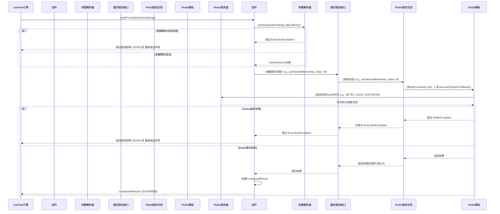
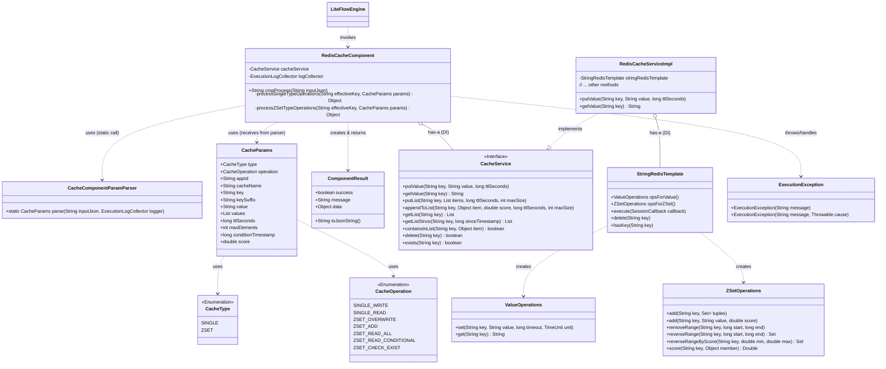

# 技术设计文档：LiteFlow Redis缓存组件

## 1. 引言 (Introduction)

### 1.1. 项目背景 (Project Background)
在现代化的业务流程管理中，工作流引擎（如LiteFlow）扮演着至关重要的角色，它负责编排和执行复杂的业务逻辑。为了提升系统性能、降低对底层数据源的访问压力，并加速热点数据的读取速度，引入缓存机制是常见的优化手段。本Redis缓存组件旨在为LiteFlow工作流引擎提供一个通用、可配置的缓存节点能力，使得开发者可以在流程定义中方便地集成缓存读写操作。

### 1.2. 文档目的 (Document Purpose)
本文档旨在详细阐述LiteFlow Redis缓存组件的技术设计方案。内容包括功能需求、系统设计、核心组件模型、主要工作流程、关键伪代码实现以及组件交互方式等。本文档的目标读者为项目开发人员、测试人员以及对该组件感兴趣的相关技术人员，旨在为组件的开发、维护和后续迭代提供清晰的指导和参考。

### 1.3. 名词解释 (Glossary)
*   **LiteFlow**: 一款轻量、快速、稳定、可编排的国产规则引擎和流程引擎。
*   **NodeComponent**: LiteFlow中的组件节点，是构成流程的基本单元。
*   **Redis**: 一个开源的、高性能的键值对存储数据库，常用于缓存、消息队列等场景。
*   **ZSET (Sorted Set)**: Redis中的一种数据结构，每个元素都会关联一个double类型的分数（score），Redis通过分数来为集合中的成员进行从小到大的排序。
*   **TTL (Time-To-Live)**: 数据的存活时间。超过该时间的缓存数据将被自动删除。
*   **DTO (Data Transfer Object)**: 数据传输对象，用于在不同层或模块之间传递数据。

## 2. 功能需求 (Functional Requirements)

### 2.1. 概述 (Overview)
Redis缓存组件作为LiteFlow的一个功能节点，需要提供灵活且通用的缓存操作能力，主要支持单值（String）和列表（基于Redis ZSET）两种数据模式的读写。

### 2.2. 单值模式 (Single Value Mode)
基于Redis的String类型实现。
*   **2.2.1. 写入 (Write - `SINGLE_WRITE`)**:
    *   根据指定的Key，将单个字符串值存入缓存。
    *   如果Key已存在，则覆盖其旧值。
    *   可为缓存项指定TTL（单位：秒）。如果未指定或指定无效，则使用系统默认TTL。
    *   支持Key前缀（appId, cacheName）和可选的Key后缀（keySuffix）共同构成最终Redis Key。
*   **2.2.2. 读取 (Read - `SINGLE_READ`)**:
    *   根据指定的Key，从缓存中获取对应的字符串值。
    *   如果Key不存在或已过期，则返回`null`。
    *   支持Key前缀和可选的Key后缀。

### 2.3. 列表模式 (List Mode - 基于Redis ZSET实现)
利用Redis的ZSET结构存储有序的字符串列表，元素的score通常用于存储时间戳，实现按时间排序。
*   **2.3.1. 覆盖写入 (Overwrite Write - `ZSET_OVERWRITE`)**:
    *   根据指定的Key，用一组新的字符串值完全替换已存在的列表（如果存在）。
    *   新列表中的所有元素将被赋予相同的score（通常是当前操作的时间戳）。
    *   可为列表指定TTL（单位：秒）。
    *   可指定列表的最大长度（`maxElements`）。若提供的列表元素数量超出此限制（且`maxElements`为正数），应抛出错误或进行截断（当前设计为抛出错误）。
    *   支持Key前缀和可选的Key后缀。
*   **2.3.2. 追加元素 (Add Element - `ZSET_ADD`)**:
    *   向指定Key的列表中追加一个新的字符串元素，并为其指定一个score。
    *   可为列表指定TTL，每次追加时刷新TTL。
    *   可指定列表的最大长度（`maxElements`）。如果追加后列表长度超过此限制（且`maxElements`为正数），则会从列表头部（score最低，通常是时间戳最早的元素）淘汰多余的元素，以维持列表长度。
    *   支持Key前缀和可选的Key后缀。
*   **2.3.3. 全部读取 (Read All - `ZSET_READ_ALL`)**:
    *   根据指定的Key，读取列表中的所有元素。
    *   返回的列表元素默认按score（时间戳）从大到小排序（即最新追加的元素在前）。
    *   支持Key前缀和可选的Key后缀。
*   **2.3.4. 条件读取 (Conditional Read - `ZSET_READ_CONDITIONAL`)**:
    *   根据指定的Key和`conditionTimestamp`（score下限），读取列表中score值大于或等于该时间戳的所有元素。
    *   返回的列表元素默认按score从大到小排序。
    *   支持Key前缀和可选的Key后缀。
*   **2.3.5. 元素查重/存在性检查 (Check Existence - `ZSET_CHECK_EXIST`)**:
    *   根据指定的Key和目标字符串值，检查该值是否存在于列表中。
    *   返回布尔值（`true`表示存在，`false`表示不存在）。
    *   支持Key前缀和可选的Key后缀。

### 2.4. 界面交互要点 (UI Interaction Highlights - 供前端参考)
*   **公共输入**: `appId` (应用ID), `cacheName` (缓存实例名), `key` (主键), `keySuffix` (可选键后缀)。
*   **操作类型 (`type`) 选择**:
    *   选择 `SINGLE` (单值):
        *   **操作 (`operation`)**: `SINGLE_WRITE`, `SINGLE_READ`。
        *   `SINGLE_WRITE` 时: 显示 `value` (字符串输入), `ttlSeconds` (可选数字输入)。
        *   `SINGLE_READ` 时: 无额外输入。
    *   选择 `ZSET` (列表):
        *   **操作 (`operation`)**: `ZSET_OVERWRITE`, `ZSET_ADD`, `ZSET_READ_ALL`, `ZSET_READ_CONDITIONAL`, `ZSET_CHECK_EXIST`。
        *   `ZSET_OVERWRITE` 时: 显示 `value` (JSON数组字符串输入, e.g., `["item1", "item2"]`), `ttlSeconds` (可选), `maxElements` (可选)。
        *   `ZSET_ADD` 时: 显示 `value` (单个字符串输入), `score` (数字输入), `ttlSeconds` (可选), `maxElements` (可选)。
        *   `ZSET_READ_ALL` 时: 无额外输入。
        *   `ZSET_READ_CONDITIONAL` 时: 显示 `conditionTimestamp` (数字输入)。
        *   `ZSET_CHECK_EXIST` 时: 显示 `value` (单个字符串输入)。

## 3. 系统设计 (System Design)

### 3.1. 设计原则 (Design Principles)
*   **高内聚低耦合 (High Cohesion, Low Coupling)**: 各模块职责清晰，模块间依赖关系简单明确。例如，参数解析、核心业务逻辑、Redis服务交互分离。
*   **可扩展性 (Extensibility)**: 设计应易于未来功能的扩展，如支持新的缓存类型、操作，或接入其他缓存中间件。
*   **可维护性 (Maintainability)**: 代码结构清晰，命名规范，注释适量，易于理解和修改。
*   **健壮性 (Robustness)**: 组件应能妥善处理各种预期和异常情况，如参数校验、错误捕获、默认值处理，保证服务的稳定可靠。
*   **易用性 (Usability)**: 作为LiteFlow组件，其参数设计和返回结果应易于理解和使用。

### 3.2. 核心组件模型 (Core Component Model)

#### 3.2.1. 概述 (Overview)
Redis缓存组件是LiteFlow流程中的一个可执行节点。当流程执行到该组件时，它会接收LiteFlow传递的参数（通常是一个JSON字符串），解析这些参数以确定具体的缓存操作类型和所需数据。然后，它调用封装了Redis交互逻辑的服务层来执行实际的缓存读写，并将执行结果或发生的异常返回给LiteFlow引擎。

#### 3.2.2. 关键类与枚举 (Key Classes and Enums)

*   **`RedisCacheComponent`**:
    *   **角色**: LiteFlow的核心组件类（继承自`NodeComponent`），是缓存功能的入口和执行单元。
    *   **核心职责**:
        1.  接收LiteFlow引擎传入的JSON字符串参数。
        2.  调用`CacheComponentParamParser`对输入参数进行解析、校验和转换，生成`CacheParams`对象。
        3.  根据`CacheParams`中的`appId`, `cacheName`, `key`, `keySuffix`构建最终在Redis中使用的`effectiveKey`。
        4.  根据`CacheParams`中的`CacheType`和`CacheOperation`，分发到`CacheService`接口的相应方法执行具体操作。
        5.  处理`CacheService`返回的结果或异常，封装成`ComponentResult`对象，并序列化为JSON字符串返回给LiteFlow引擎。

*   **`CacheParams`**:
    *   **DTO用途**: 数据传输对象，用于封装从输入参数中解析出来的、经过校验和转换的结构化数据，供后续业务逻辑使用。
    *   **关键字段及其含义**:
        *   `appId` (String): 应用ID，用于构建Redis Key的一部分，实现多应用隔离。
        *   `cacheName` (String): 缓存实例名，用于构建Redis Key的另一部分，实现同一应用内不同业务缓存的隔离。
        *   `type` (`CacheType`): 缓存类型，如`SINGLE`或`ZSET`。
        *   `key` (String): 缓存项的主键。
        *   `keySuffix` (String): 可选的键后缀，附加在主键后，用于更细粒度的划分。
        *   `operation` (`CacheOperation`): 具体操作类型，如`SINGLE_WRITE`。
        *   `value` (String): 单个字符串值，用于`SINGLE_WRITE`, `ZSET_ADD`, `ZSET_CHECK_EXIST`。
        *   `values` (`List<Object>`): 对象列表，用于`ZSET_OVERWRITE`，从输入的JSON数组字符串解析而来。
        *   `conditionTimestamp` (long): 时间戳条件，用于`ZSET_READ_CONDITIONAL`。
        *   `ttlSeconds` (long): 缓存存活时间（秒）。若输入无效或未提供，则使用默认值。
        *   `maxElements` (int): ZSET类型列表的最大元素数量。若输入无效或未提供，则使用默认值。
        *   `score` (double): ZSET中元素的分数，用于`ZSET_ADD`。

*   **`CacheService` (接口)**:
    *   **重要性**: 定义了缓存操作的核心服务契约。`RedisCacheComponent`依赖此接口而非具体实现，这使得底层缓存技术（如Redis）可以被替换或扩展，而对上层组件影响最小。
    *   **标准缓存操作方法**:
        *   `putValue(String key, String value, long ttlSeconds)`
        *   `getValue(String key)`
        *   `putList(String key, List<Object> items, long ttlSeconds, int maxSize)`
        *   `appendToList(String key, Object item, double score, long ttlSeconds, int maxSize)`
        *   `getList(String key)`
        *   `getListSince(String key, long sinceTimestamp)`
        *   `containsInList(String key, Object item)`
        *   `delete(String key)`
        *   `exists(String key)`

*   **`RedisCacheServiceImpl`**:
    *   **角色**: `CacheService`接口的Redis具体实现类。
    *   **核心职责**: 封装所有与Redis服务器的直接交互逻辑。它使用`StringRedisTemplate`来执行Redis命令，处理例如数据序列化、连接管理等底层细节。对于需要原子性的操作（如`putList`, `appendToList`），它会利用Redis的事务（`MULTI`/`EXEC`）或Lua脚本（当前设计中使用`SessionCallback`配合`MULTI`/`EXEC`）来保证操作的原子性。

*   **`CacheType` (枚举)**:
    *   `SINGLE`: 单值模式。在Redis中通常对应String类型。适用于存储独立的键值对。
    *   `ZSET`: 列表模式。在Redis中对应Sorted Set（有序集合）类型。适用于需要排序（如按时间）、去重、范围查询的列表场景。

*   **`CacheOperation` (枚举)**:
    *   定义了组件支持的所有具体缓存操作及其适用的`CacheType`。
        *   `SINGLE_WRITE` (适用于 `SINGLE`): 写入/覆盖单个缓存值。
        *   `SINGLE_READ` (适用于 `SINGLE`): 读取单个缓存值。
        *   `ZSET_OVERWRITE` (适用于 `ZSET`): 用新列表覆盖旧列表。
        *   `ZSET_ADD` (适用于 `ZSET`): 向列表中追加一个带分数的元素，并可能进行修剪。
        *   `ZSET_READ_ALL` (适用于 `ZSET`): 读取列表中的所有元素。
        *   `ZSET_READ_CONDITIONAL` (适用于 `ZSET`): 根据score（时间戳）条件读取列表元素。
        *   `ZSET_CHECK_EXIST` (适用于 `ZSET`): 检查列表中是否存在指定元素。

*   **`ComponentResult`**:
    *   **通用结果封装**: 组件执行完毕后，向LiteFlow引擎返回的标准化结果对象，通常序列化为JSON字符串。
        *   `success` (boolean): 操作是否成功。
        *   `message` (String): 结果消息，如 "Success" 或具体的错误信息。
        *   `data` (Object): 操作返回的数据。
    *   **`data`字段类型**:
        *   `SINGLE_READ`: 返回String类型的值，若不存在则为`null`。
        *   `ZSET_READ_ALL`, `ZSET_READ_CONDITIONAL`: 返回`List<String>`。
        *   `ZSET_CHECK_EXIST`: 返回`Boolean`。
        *   所有写入类操作 (`SINGLE_WRITE`, `ZSET_OVERWRITE`, `ZSET_ADD`): `data`字段通常为`null`，成功状态通过`success`字段和`message`体现。

*   **`CacheComponentParamParser`**:
    *   **角色**: 参数处理工具类，负责将`RedisCacheComponent`接收到的原始输入（JSON字符串）转化为结构化、经过校验的`CacheParams`对象。
    *   **核心职责**:
        1.  解析JSON输入。
        2.  校验必填字段（如`type`, `key`, `operation`, `appId`, `cacheName`以及操作相关的`value`, `conditionTimestamp`等）是否存在。
        3.  将字符串形式的`type`和`operation`转换为对应的`CacheType`和`CacheOperation`枚举，并处理无效枚举值。
        4.  校验`CacheOperation`是否适用于指定的`CacheType`。
        5.  解析并转换其他字段，如将时间相关的`ttlSeconds`, `conditionTimestamp`转为数值；将`value`（用于`ZSET_OVERWRITE`）从JSON数组字符串转为`List<Object>`。
        6.  为可选参数（如`ttlSeconds`, `maxElements`）在未提供或提供格式不正确时设置默认值。
        7.  若解析或校验失败，则抛出`ExecutionException`，携带详细错误信息。

#### 3.2.3. 设计理由 (Design Rationale)

*   **可扩展性 (Extensibility)**:
    *   **接口化服务**: `CacheService`接口定义了清晰的缓存操作契约。未来若要支持如Memcached等其他缓存系统，只需新增一个实现该接口的类（如`MemcachedCacheServiceImpl`），并在配置中切换实现，`RedisCacheComponent`无需改动。
    *   **枚举驱动**: `CacheType`和`CacheOperation`枚举使得添加新的缓存模式或操作类型更为规范。新增枚举值后，主要修改点在于`RedisCacheComponent`的逻辑分发（`switch`语句）、`CacheComponentParamParser`的参数解析和校验逻辑，以及`CacheService`接口（可能需要新增方法）及其实现。
    *   **模块化设计**:
        *   参数解析（`CacheComponentParamParser`）的独立，使得参数格式或校验规则的变化不直接冲击核心业务逻辑。
        *   核心业务逻辑（`RedisCacheComponent`）专注于流程编排和与LiteFlow的交互。
        *   服务实现（`RedisCacheServiceImpl`）封装了与特定缓存中间件的交互细节。

*   **命名与清晰度 (Naming and Clarity)**:
    *   **统一命名**: 类、方法、枚举、参数等采用统一且能清晰表达意图的命名（如`CacheParams`, `SINGLE_WRITE`, `putValue`），降低理解成本。
    *   **关注点分离**: 各类的职责明确，如`CacheComponentParamParser`专职参数处理，`RedisCacheServiceImpl`专职Redis操作，使得代码结构清晰，易于定位和修改。

*   **健壮性 (Robustness)**:
    *   **统一异常处理**: 使用自定义的`ExecutionException`来封装业务执行过程中的可预见错误（如参数校验失败、操作不支持等）。这使得上层调用者（LiteFlow引擎）可以统一捕获和处理组件异常。对于底层依赖（如Redis连接异常），则捕获原始异常并包装为`ExecutionException`抛出，同时记录详细错误日志。
    *   **严格参数校验**: `CacheComponentParamParser`在操作执行前对输入参数进行全面的校验，包括存在性、格式、枚举有效性、操作兼容性等，避免了将非法参数传入服务层导致运行时错误。
    *   **默认值机制**: 对`ttlSeconds`、`maxElements`等可选配置参数，在用户未提供或提供格式错误时，自动应用预设的合理默认值，增强了组件的容错能力。
    *   **原子性保障**: 对于`ZSET_OVERWRITE`和`ZSET_ADD`这类涉及多个Redis命令组合的操作（如先删除旧数据再添加新数据，或添加后进行修剪），`RedisCacheServiceImpl`通过`SessionCallback`利用Redis的`MULTI`和`EXEC`命令，确保这些操作的原子性，避免了部分成功部分失败导致的数据不一致状态。

### 3.3. 核心流程 (Core Workflows)

#### 3.3.1. `RedisCacheComponent.cmpProcess` 主流程
```mermaid
graph TD
    A[LiteFlow调用cmpProcess(inputJson)] --> B{解析参数 CacheComponentParamParser.parse};
    B -- 成功 --> C[构建EffectiveKey];
    B -- 失败(ExecutionException) --> F[记录错误日志];
    F --> G[抛出ExecutionException/返回错误结果];
    C --> D{根据CacheType分发};
    D -- SINGLE --> E1[执行单值操作 processSingleTypeOperations];
    D -- ZSET --> E2[执行ZSET操作 processZSetTypeOperations];
    D -- 不支持的Type --> F;
    E1 -- 成功 --> H[封装成功结果 ComponentResult.success(data)];
    E1 -- 失败(ExecutionException) --> F;
    E2 -- 成功 --> H;
    E2 -- 失败(ExecutionException) --> F;
    H --> I[返回JSON结果给LiteFlow];
    subgraph "组件内部"
        B
        C
        D
        E1
        E2
    end
```
**文字描述**:
1.  LiteFlow引擎调用`RedisCacheComponent`的`cmpProcess`方法，传入JSON字符串形式的参数。
2.  组件调用`CacheComponentParamParser.parse`方法对输入JSON进行解析和校验。若失败，则记录错误并向上抛出`ExecutionException`或返回错误信息的`ComponentResult`。
3.  若参数解析成功，得到`CacheParams`对象。根据`appId`, `cacheName`, `key`, `keySuffix`构建最终的`effectiveKey`。
4.  根据`CacheParams.getType()`判断是`SINGLE`还是`ZSET`类型操作。
5.  **单值操作**: 调用`processSingleTypeOperations`方法，该方法内部再根据`CacheParams.getOperation()`（如`SINGLE_WRITE`, `SINGLE_READ`）调用`CacheService`对应的方法。
6.  **ZSET操作**: 调用`processZSetTypeOperations`方法，该方法内部再根据`CacheParams.getOperation()`（如`ZSET_OVERWRITE`, `ZSET_ADD`等）调用`CacheService`对应的方法。
7.  若操作类型或具体操作不受支持，则抛出`ExecutionException`。
8.  `CacheService`执行操作后返回结果或抛出异常。组件捕获这些信息。
9.  将执行结果（数据或成功标识）封装到`ComponentResult`对象中。
10. 将`ComponentResult`对象序列化为JSON字符串，返回给LiteFlow引擎。
11. 任何未被`CacheComponentParamParser`或`CacheService`捕获的意外异常，也会被组件捕获、记录日志，并包装成`ExecutionException`抛出。

#### 3.3.2. 参数解析流程 (`CacheComponentParamParser.parse`)
1.  接收JSON字符串输入和`ExecutionLogCollector`。
2.  将JSON字符串转换为`Map<String, Object>`。
3.  **提取和校验核心字段**:
    *   `appId`, `cacheName`, `key`: 使用`requireString`确保存在且不为空。
    *   `keySuffix`: 使用`getStringOptional`获取，允许为空，并进行trim。
    *   `type`: 使用`requireString`获取，再通过`CacheType.fromCode`转换为枚举。若转换失败（无效type字符串），抛出`ExecutionException`。
    *   `operation`: 使用`requireString`获取，再通过`CacheOperation.fromCode`转换为枚举。若转换失败，抛出`ExecutionException`。
4.  **校验操作与类型兼容性**: 检查解析出的`CacheOperation`是否适用于解析出的`CacheType`。例如，`SINGLE_WRITE`不能用于`ZSET`。若不兼容，抛出`ExecutionException`。
5.  **创建`CacheParams`实例**并填充已解析的核心字段。
6.  **解析可选和操作特定字段**:
    *   `ttlSeconds`: 使用`getLongOptional`，若输入非正数或格式错误，则使用`CacheParams.DEFAULT_TTL_SECONDS`，并可能记录警告。
    *   `maxElements` (ZSET适用): 使用`getIntegerOptional`，处理方式类似`ttlSeconds`，默认值为`CacheParams.DEFAULT_MAX_ELEMENTS`。
    *   **根据`operation`进一步解析**:
        *   `SINGLE_WRITE`: `value`（`requireString`）。
        *   `ZSET_OVERWRITE`: `value`（`requireString`，必须是有效的非空JSON数组字符串，然后解析为`List<Object>`）。
        *   `ZSET_ADD`: `value`（`requireString`），`score`（`requireDouble`）。
        *   `ZSET_CHECK_EXIST`: `value`（`requireString`）。
        *   `ZSET_READ_CONDITIONAL`: `conditionTimestamp`（`requireLong`）。
7.  所有字段解析并填充完毕后，返回`CacheParams`对象。任何`require`失败或校验不通过都会中断流程并抛出`ExecutionException`。

#### 3.3.3. 单值操作流程 (`processSingleTypeOperations` 及 `CacheService` 实现)
*   **`RedisCacheComponent.processSingleTypeOperations`**:
    1.  接收`effectiveKey`和`CacheParams`。
    2.  根据`params.getOperation()`进行`switch`:
        *   `SINGLE_WRITE`: 调用 `cacheService.putValue(effectiveKey, params.getValue(), params.getTtl())`。返回`null`（表示成功，无数据体）。
        *   `SINGLE_READ`: 调用 `cacheService.getValue(effectiveKey)`。返回获取到的字符串或`null`。
        *   `default`: 抛出`ExecutionException`指明不支持的操作。
*   **`RedisCacheServiceImpl.putValue`**:
    1.  调用 `stringRedisTemplate.opsForValue().set(key, value, ttlSeconds, TimeUnit.SECONDS)`。
    2.  若Redis操作抛出异常，捕获并包装为`ExecutionException`。
*   **`RedisCacheServiceImpl.getValue`**:
    1.  调用 `stringRedisTemplate.opsForValue().get(key)`。
    2.  若Redis操作抛出异常，捕获并包装为`ExecutionException`。返回获取到的值。

#### 3.3.4. ZSET列表操作流程 (`processZSetTypeOperations` 及 `CacheService` 实现)
*   **`RedisCacheComponent.processZSetTypeOperations`**:
    1.  接收`effectiveKey`和`CacheParams`。
    2.  根据`params.getOperation()`进行`switch`:
        *   `ZSET_OVERWRITE`: 调用 `cacheService.putList(effectiveKey, params.getValues(), params.getTtl(), params.getMaxElements())`。返回`null`。
        *   `ZSET_ADD`: 调用 `cacheService.appendToList(effectiveKey, params.getValue(), params.getScore(), params.getTtl(), params.getMaxElements())`。返回`null`。
        *   `ZSET_READ_ALL`: 调用 `cacheService.getList(effectiveKey)`。返回`List<String>`。
        *   `ZSET_READ_CONDITIONAL`: 调用 `cacheService.getListSince(effectiveKey, params.getConditionTimestamp())`。返回`List<String>`。
        *   `ZSET_CHECK_EXIST`: 调用 `cacheService.containsInList(effectiveKey, params.getValue())`。返回`Boolean`。
        *   `default`: 抛出`ExecutionException`。
*   **`RedisCacheServiceImpl.putList` (原子性)**:
    1.  前置检查：如果`maxSize > 0`且`items.size() > maxSize`，则直接抛出`ExecutionException`。
    2.  使用`stringRedisTemplate.execute(new SessionCallback<...>() { ... })`执行事务：
        *   `redisOperations.multi()`: 开启事务。
        *   `redisOperations.delete(key)`: 删除旧列表。
        *   如果`items`不为空，为每个`item`创建`DefaultTypedTuple`，score统一设为当前时间戳`System.currentTimeMillis()`。
        *   `redisOperations.opsForZSet().add(key, tuples)`: 添加所有新元素。
        *   `redisOperations.expire(key, ttlSeconds, TimeUnit.SECONDS)`: 设置TTL。
        *   `redisOperations.exec()`: 执行事务。
    3.  若Redis操作抛出异常，捕获并包装为`ExecutionException`。
*   **`RedisCacheServiceImpl.appendToList` (原子性与长度控制)**:
    1.  使用`stringRedisTemplate.execute(new SessionCallback<...>() { ... })`执行事务：
        *   `redisOperations.multi()`: 开启事务。
        *   `redisOperations.opsForZSet().add(key, item.toString(), score)`: 添加新元素及其指定score。
        *   如果`maxSize > 0`，执行 `redisOperations.opsForZSet().removeRange(key, 0, -(maxSize + 1))` 来移除超出长度的旧元素（score最低的元素）。
        *   `redisOperations.expire(key, ttlSeconds, TimeUnit.SECONDS)`: （重新）设置TTL。
        *   `redisOperations.exec()`: 执行事务。
    2.  若Redis操作抛出异常，捕获并包装为`ExecutionException`。
*   其他ZSET读取操作 (`getList`, `getListSince`, `containsInList`) 相对简单，直接调用`stringRedisTemplate.opsForZSet()`的相应方法（`reverseRange`, `reverseRangeByScore`, `score`），并处理返回结果（如`null`转为空列表，`score != null`转为`true`）。同样，异常会被捕获和包装。

### 3.4. 错误处理机制 (Error Handling Mechanism)

*   **`ExecutionException`的使用场景**:
    *   参数解析失败（如必填项缺失、格式错误、枚举值无效）。
    *   参数校验失败（如操作与类型不兼容、`ZSET_OVERWRITE`时列表超长）。
    *   业务逻辑明确定义的错误（如不支持的操作类型）。
    *   底层服务（如Redis）发生异常时，作为包装异常向上抛出。
    *   `ExecutionException`应包含易于理解的错误信息，方便问题定位。

*   **外部依赖异常的捕获与封装**:
    *   在`RedisCacheServiceImpl`中，所有对`StringRedisTemplate`的调用都置于`try-catch`块中。
    *   捕获通用的`RuntimeException`或更具体的Redis相关异常（如`RedisConnectionFailureException`）。
    *   捕获到的原始异常会作为`cause`包装在新的`ExecutionException`中，以便保留原始的堆栈信息。
    *   新的`ExecutionException`会附带一个更贴近业务场景的错误描述（如“Error putting value to Redis”）。

*   **日志记录策略**:
    *   **错误日志**: 当捕获到任何预期或意外的异常，导致操作失败时，应使用`ExecutionLogCollector`（如果由LiteFlow提供并注入）或标准日志框架（如SLF4J）记录错误级别（ERROR）的日志。日志内容应包括：
        *   错误发生的上下文信息（如操作类型、Key）。
        *   明确的错误消息。
        *   异常堆栈信息（尤其是包装了原始异常时）。
    *   **警告日志 (WARN)**: 对于某些非致命但值得注意的情况，可以记录警告日志。例如：
        *   当用户提供的`ttlSeconds`或`maxElements`格式不正确或为非正数，导致系统采用默认值时。
        *   当`ZSET_OVERWRITE`时，如果未来设计为自动截断而不是报错，那么截断行为可以记录警告。
    *   **调试日志 (DEBUG/INFO)**:
        *   `RedisCacheComponent.cmpProcess`开始执行时，可以记录INFO级别的日志，包含解析后的`CacheParams`和`effectiveKey`，便于追踪请求。
        *   `CacheComponentParamParser`在成功解析后，也可以记录DEBUG日志。
        *   `RedisCacheServiceImpl`中关键的Redis命令执行前后，可以记录DEBUG日志。

## 4. 核心伪代码 (Core Pseudocode)

**4.1. `RedisCacheComponent.cmpProcess`**:
```pseudocode
// RedisCacheComponent.cmpProcess
函数 cmpProcess(输入JSON字符串):
    尝试:
        // logCollector 可用于记录日志
        参数对象 = CacheComponentParamParser.解析(输入JSON字符串, logCollector)
        有效Key = 参数对象.应用ID + ":" + 参数对象.缓存名 + ":" + 参数对象.主键
        如果 参数对象.键后缀 非空:
            有效Key = 有效Key + ":" + 参数对象.键后缀

        记录日志 "处理操作 " + 参数对象.操作类型 + "，有效Key: " + 有效Key

        返回数据 = null
        消息 = "Success" // 默认成功消息

        开关 (参数对象.缓存类型):
            情况 SINGLE:
                开关 (参数对象.操作类型):
                    情况 SINGLE_WRITE:
                        缓存服务.写入值(有效Key, 参数对象.值, 参数对象.TTL)
                        // 写入操作成功，返回数据通常为null
                        中断
                    情况 SINGLE_READ:
                        返回数据 = 缓存服务.读取值(有效Key)
                        中断
                    默认:
                        抛出 执行异常("不支持的操作 " + 参数对象.操作类型 + " 对于 SINGLE 类型")
                中断
            情况 ZSET:
                开关 (参数对象.操作类型):
                    情况 ZSET_OVERWRITE:
                        缓存服务.写入列表(有效Key, 参数对象.值列表, 参数对象.TTL, 参数对象.最大元素数)
                        中断
                    情况 ZSET_ADD:
                        缓存服务.追加到列表(有效Key, 参数对象.值, 参数对象.分数, 参数对象.TTL, 参数对象.最大元素数)
                        中断
                    情况 ZSET_READ_ALL:
                        返回数据 = 缓存服务.读取列表(有效Key)
                        中断
                    情况 ZSET_READ_CONDITIONAL:
                        返回数据 = 缓存服务.按条件读取列表(有效Key, 参数对象.条件时间戳)
                        中断
                    情况 ZSET_CHECK_EXIST:
                        返回数据 = 缓存服务.列表中是否存在(有效Key, 参数对象.值)
                        中断
                    默认:
                        抛出 执行异常("不支持的操作 " + 参数对象.操作类型 + " 对于 ZSET 类型")
                中断
            默认:
                // 此处应由参数解析器捕获，作为最后防线
                抛出 执行异常("不支持的缓存类型: " + 参数对象.缓存类型)

        返回 ComponentResult.成功(返回数据, 消息).转换为JSON字符串()
    捕获 执行异常 e:
        记录错误日志(e.消息, e)
        // LiteFlow可能期望JSON错误字符串，或直接抛出由引擎处理
        抛出 e // 或者返回 ComponentResult.失败(e.消息).转换为JSON字符串()
    捕获 其他异常 e:
        记录错误日志("RedisCacheComponent发生意外错误", e)
        抛出 新的执行异常("执行Redis缓存操作时出错", e) // 或者返回错误JSON
```

**4.2. `CacheComponentParamParser.parse` (简化版)**:
```pseudocode
// CacheComponentParamParser.parse
函数 解析(输入JSON字符串, 日志收集器):
    输入Map = JSON.解析为Map(输入JSON字符串)

    // 校验并获取appId, cacheName, key - 若缺失则抛出异常
    应用ID = 必须字符串(输入Map, "appId", "appId是必需的")
    缓存名 = 必须字符串(输入Map, "cacheName", "cacheName是必需的")
    主键 = 必须字符串(输入Map, "key", "key是必需的")
    键后缀 = 可选字符串(输入Map, "keySuffix") // 可选, 会进行trim

    类型字符串 = 必须字符串(输入Map, "type", "type是必需的")
    缓存类型 = CacheType.根据代码获取(类型字符串)
    如果 缓存类型 为 null:
        抛出 新的执行异常("无效的缓存类型: " + 类型字符串)

    操作字符串 = 必须字符串(输入Map, "operation", "operation是必需的")
    操作类型 = CacheOperation.根据代码获取(操作字符串)
    如果 操作类型 为 null:
        抛出 新的执行异常("无效的缓存操作: " + 操作字符串 + " 对于类型 " + 缓存类型)

    // 校验类型与操作的兼容性
    校验操作对于类型(缓存类型, 操作类型) // 若不兼容则抛出执行异常

    缓存参数对象 = 新的 CacheParams()
    缓存参数对象.设置应用ID(应用ID)
    // ... 设置其他已解析的核心字段 ...
    缓存参数对象.设置缓存类型(缓存类型)
    缓存参数对象.设置操作类型(操作类型)

    // 根据操作类型填充特定字段:
    TTL = 可选长整型(输入Map, "ttlSeconds", CacheParams.默认TTL, 日志收集器) // 格式错误或<=0则用默认值
    缓存参数对象.设置TTL(TTL)

    如果 缓存类型 == CacheType.SINGLE:
        如果 操作类型 == CacheOperation.SINGLE_WRITE:
            缓存参数对象.设置值(必须字符串(输入Map, "value", "SINGLE_WRITE操作需要value"))
    否则 如果 缓存类型 == CacheType.ZSET:
        最大元素数 = 可选整型(输入Map, "maxElements", CacheParams.默认最大元素数, 日志收集器) // 类似TTL
        缓存参数对象.设置最大元素数(最大元素数)

        如果 操作类型 == CacheOperation.ZSET_OVERWRITE:
            值字符串 = 必须字符串(输入Map, "value", "ZSET_OVERWRITE操作需要value")
            解析后列表 = JSON.解析列表(值字符串, Object.class)
            如果 解析后列表 为空:
                抛出 新的执行异常("ZSET_OVERWRITE的value必须是非空的JSON数组字符串")
            缓存参数对象.设置值列表(解析后列表)
        // ... 其他ZSET操作的特定字段解析 ...
        否则 如果 操作类型 == CacheOperation.ZSET_ADD:
            缓存参数对象.设置值(必须字符串(输入Map, "value", "ZSET_ADD操作需要value"))
            缓存参数对象.设置分数(必须双精度浮点型(输入Map, "score", "ZSET_ADD操作需要score"))
        // ...

    返回 缓存参数对象
```

**4.3. `RedisCacheServiceImpl.putList` (体现原子性)**:
```pseudocode
// RedisCacheServiceImpl.putList
函数 写入列表(键, 元素列表, TTL(秒), 最大元素数):
    如果 最大元素数 > 0 且 元素列表.大小() > 最大元素数:
        抛出 新的执行异常("元素列表大小 " + 元素列表.大小() + " 超过了最大允许值 " + 最大元素数)

    尝试:
        // stringRedisTemplate.execute(SessionCallback)
        执行Redis事务 (redis操作对象): // redis操作对象 是 RedisOperations<String, String>
            redis操作对象.multi() // 开启事务
            redis操作对象.delete(键) // 删除旧列表
            如果 元素列表 非空:
                时间戳 = System.currentTimeMillis()
                元组集合 = 新的 HashSet()
                对于 元素列表中的每个元素:
                    元组集合.添加(新的 DefaultTypedTuple(元素.toString(), (double)时间戳))
                redis操作对象.opsForZSet().add(键, 元组集合) // 添加所有新元素
            redis操作对象.expire(键, TTL(秒), TimeUnit.SECONDS) // 设置TTL
            返回 redis操作对象.exec() // 执行事务，返回事务中各命令的结果列表
    捕获 异常 e:
        抛出 新的执行异常("向Redis写入列表时出错，键: " + 键, e)
```

**4.4. `RedisCacheServiceImpl.appendToList` (体现原子性和长度控制)**:
```pseudocode
// RedisCacheServiceImpl.appendToList
函数 追加到列表(键, 元素, 分数, TTL(秒), 最大元素数):
    尝试:
        // stringRedisTemplate.execute(SessionCallback)
        执行Redis事务 (redis操作对象):
            redis操作对象.multi() // 开启事务
            redis操作对象.opsForZSet().add(键, 元素.toString(), 分数) // 添加新元素及其指定分数
            如果 最大元素数 > 0:
                // 保持列表最多有'最大元素数'个元素。
                // ZREMRANGEBYRANK key 0 -(最大元素数 + 1) 会移除排名最低的元素（如果分数是时间戳，则是最早的元素）
                // 直到列表剩下'最大元素数'个。
                redis操作对象.opsForZSet().removeRange(键, 0, -(最大元素数 + 1))
            redis操作对象.expire(键, TTL(秒), TimeUnit.SECONDS) // （重新）设置TTL
            返回 redis操作对象.exec()
    捕获 异常 e:
        抛出 新的执行异常("向Redis列表追加元素时出错，键: " + 键, e)

```

## 5. 设计图 (Design Diagram)

### 5.1. 组件交互图 (Component Interaction Diagram)



**流程描述**:
1.  **LiteFlow引擎** 调用 `RedisCacheComponent.cmpProcess(inputJsonString)`，传入JSON格式的参数。
2.  `RedisCacheComponent` 将JSON字符串和日志收集器（可选）传递给 `CacheComponentParamParser.parse()`。
3.  `CacheComponentParamParser` 进行参数解析与校验：
    *   若失败，则抛出 `ExecutionException`，由 `RedisCacheComponent` 捕获并转化为错误结果返回给LiteFlow引擎。
    *   若成功，则返回一个填充好的 `CacheParams` DTO。
4.  `RedisCacheComponent` 根据 `CacheParams` 构建 `effectiveKey`，并根据 `CacheParams` 中的 `type` 和 `operation` 决定调用哪个 `CacheService` 接口方法。
5.  调用 `CacheService` 接口的方法，实际执行会路由到 `RedisCacheServiceImpl` 中的对应实现。
6.  `RedisCacheServiceImpl` 使用 `StringRedisTemplate` 来执行具体的Redis命令。对于涉及多步的原子操作（如`putList`, `appendToList`），会使用`SessionCallback`配合Redis事务（`MULTI`/`EXEC`）。
7.  `StringRedisTemplate` 与 **Redis服务器** 进行通信。
8.  Redis服务器返回命令执行结果或状态。
9.  `StringRedisTemplate` 将结果返回给 `RedisCacheServiceImpl`：
    *   若Redis操作出错（如连接失败、命令错误），`StringRedisTemplate` 可能抛出Redis相关的异常。`RedisCacheServiceImpl` 会捕获这些异常，包装成 `ExecutionException`，并向上传递。
    *   若操作成功，则返回数据。
10. `RedisCacheServiceImpl` 对返回数据进行必要处理（如将Set转为List）后，返回给 `RedisCacheComponent`。
11. `RedisCacheComponent` 接收到服务层的返回结果（或捕获到的`ExecutionException`），将其封装到 `ComponentResult` 对象中。
12. `RedisCacheComponent` 将 `ComponentResult` 序列化为JSON字符串，最终返回给 **LiteFlow引擎**。

**关键类关系**:
*   `RedisCacheComponent` **依赖于 (has a)** `CacheService` 接口 (通过依赖注入)。
*   `RedisCacheServiceImpl` **实现 (implements)** `CacheService` 接口。
*   `RedisCacheServiceImpl` **使用 (uses)** `StringRedisTemplate` 来执行Redis操作。
*   `RedisCacheComponent` **使用 (uses)** `CacheComponentParamParser` (通常是静态方法调用) 来解析参数。

### 5.2. (可选) 类图 (Class Diagram - MermaidJS)


## 6. 未来展望 (Future Considerations) (可选)

*   **更复杂的条件读取与删除**:
    *   支持ZSET中基于score范围的删除 (`ZREMRANGEBYSCORE`)。
    *   支持更灵活的列表分页读取（如`ZREVRANGE key start end WITHSCORES`后进行应用层分页）。
*   **缓存命中率统计**: 集成简单的缓存命中/未命中统计，并通过日志或特定管理接口暴露，便于监控缓存效果。
*   **数据序列化方式可配置**: 当前默认使用`StringRedisTemplate`，主要处理字符串。未来可考虑支持更通用的`RedisTemplate<String, Object>`并允许配置不同的序列化器（如JSON、Kryo）以支持非字符串对象的直接缓存。
*   **Lua脚本优化**: 对于复杂原子操作，可以考虑使用Lua脚本替代`SessionCallback`，以获得更极致的性能并减少网络往返。
*   **多缓存中间件适配**: 进一步抽象`CacheService`，使其不强依赖Redis特有概念（如ZSET的score），或者提供更通用的列表操作接口，以便更容易适配其他如Memcached（可能只支持简单列表）或支持更丰富数据结构的缓存系统。
*   **细粒度配置**: 允许在每个操作请求中动态覆盖一些默认配置，如特定的序列化方式、是否刷新TTL等。
*   **分布式锁集成**: 对于某些需要严格避免并发写冲突的场景，可考虑在组件层面集成基于Redis的分布式锁。
