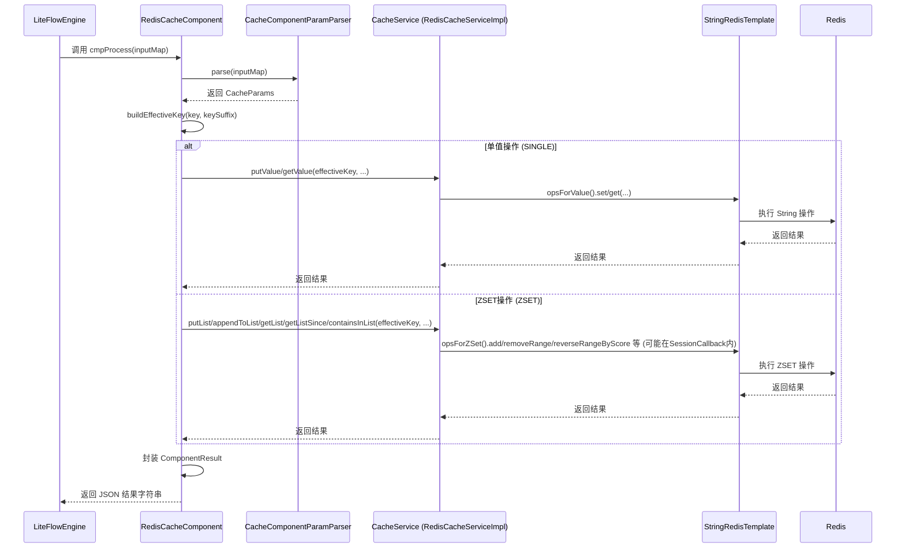

# 技术设计文档：LiteFlow Redis缓存组件 (修订版)

## 1. 引言 (Introduction)

### 1.1. 项目背景 (Project Background)
LiteFlow作为一款高效的工作流执行引擎，在处理复杂业务流程时表现出色。为了进一步提升流程执行效率，减少对外部数据源的频繁访问，并加速热点数据的获取，引入一个灵活、通用的缓存组件成为必要。本项目旨在设计并实现一个基于Redis的缓存组件，使其能够无缝集成到LiteFlow中，为流程节点提供便捷的缓存读写能力。

### 1.2. 文档目的 (Document Purpose)
本文档详细阐述了LiteFlow Redis缓存组件的技术设计方案，严格依据已提供的Java代码实现。内容覆盖功能需求、系统设计（特别是核心组件模型）、主要工作流程、关键伪代码实现以及组件交互图。本文档旨在为开发、测试、维护及后续迭代该组件的相关技术人员提供准确、一致的技术参考。

## 2. 功能需求 (Functional Requirements)

### 2.1. 概述 (Overview)
Redis缓存组件为LiteFlow流程提供数据缓存能力，支持对单个字符串值的操作和对字符串列表（基于Redis ZSET实现）的操作。

### 2.2. 单值模式 (Single Value Mode - `CacheType.SINGLE`)
*   **2.2.1. 写入 (`CacheOperation.SINGLE_WRITE`)**:
    *   功能: 向缓存中写入或覆盖一个字符串键值对。
    *   参数: 缓存键 (`key`, `keySuffix`)，待写入的值 (`value`)，可选的TTL (`ttlSeconds`)。
    *   对应服务: `CacheService.putValue(String key, String value, Integer ttlSeconds)`。
*   **2.2.2. 读取 (`CacheOperation.SINGLE_READ`)**:
    *   功能: 根据缓存键读取一个字符串值。
    *   参数: 缓存键 (`key`, `keySuffix`)。
    *   对应服务: `CacheService.getValue(String key)`。

### 2.3. 列表模式 (List Mode - `CacheType.ZSET`, implemented via Redis ZSET)
*   **2.3.1. 覆盖写入 (`CacheOperation.ZSET_OVERWRITE`)**:
    *   功能: 清空指定键的列表（如果存在），然后将一组新的字符串值批量写入该列表。所有新写入的元素具有相同的score（基于当前时间戳）。
    *   参数: 缓存键 (`key`, `keySuffix`)，待写入的字符串列表 (`valuesForZSetOverwrite`)，可选的TTL (`ttlSeconds`)，可选的列表最大长度 (`maxElements`)。
    *   对应服务: `CacheService.putList(String key, List<String> items, Integer ttlSeconds, Integer maxSize)`。
*   **2.3.2. 追加元素 (`CacheOperation.ZSET_ADD`)**:
    *   功能:向指定键的列表末尾追加一个字符串元素。元素的score基于当前时间戳。如果列表超出`maxElements`，则会从列表头部移除旧元素。
    *   参数: 缓存键 (`key`, `keySuffix`)，待追加的单个字符串值 (`value`)，可选的TTL (`ttlSeconds`)，可选的列表最大长度 (`maxElements`)。
    *   对应服务: `CacheService.appendToList(String key, String item, Integer ttlSeconds, Integer maxSize)`。
*   **2.3.3. 全部读取 (`CacheOperation.ZSET_READ_ALL`)**:
    *   功能: 读取指定键的列表中的所有元素，按score（时间戳）倒序排列。
    *   参数: 缓存键 (`key`, `keySuffix`)。
    *   对应服务: `CacheService.getList(String key)`。
*   **2.3.4. 条件读取 (`CacheOperation.ZSET_READ_CONDITIONAL`)**:
    *   功能: 读取指定键的列表中，score（时间戳）大于或等于给定`conditionTimestamp`的所有元素，按score倒序排列。
    *   参数: 缓存键 (`key`, `keySuffix`)，条件时间戳 (`conditionTimestamp`)。
    *   对应服务: `CacheService.getListSince(String key, Long sinceTimestamp)`。
*   **2.3.5. 元素查重/存在性检查 (`CacheOperation.ZSET_CHECK_EXIST`)**:
    *   功能: 检查指定的字符串元素是否存在于指定键的列表中。
    *   参数: 缓存键 (`key`, `keySuffix`)，待检查的字符串值 (`value`)。
    *   对应服务: `CacheService.containsInList(String key, String item)`。

### 2.4. 界面交互要点 (UI Interaction Highlights - based on issue description)
*   **“写入” (`SINGLE_WRITE`, `ZSET_OVERWRITE`, `ZSET_ADD`) 操作时**:
    *   显示 “写入值” (`value` / `valuesForZSetOverwrite`) 输入区域。
    *   显示 “最大生效时间” (`ttlSeconds`) 输入框（可选）。
    *   对于 `ZSET` 类型的写入，还会显示 “列表最大长度” (`maxElements`) 输入框（可选）。
*   **“读取” (`SINGLE_READ`, `ZSET_READ_ALL`, `ZSET_READ_CONDITIONAL`, `ZSET_CHECK_EXIST`) 操作时**:
    *   仅显示 “Key” 相关字段 (`key`, `keySuffix`)。
    *   `ZSET_READ_CONDITIONAL` 操作时，额外显示 “条件时间戳” (`conditionTimestamp`) 输入框。
    *   `ZSET_CHECK_EXIST` 操作时，额外显示 “检查值” (`value`) 输入框。

## 3. 系统设计 (System Design)

### 3.1. 核心组件模型 (Core Component Model)

#### 3.1.1. 概述 (Overview)
`RedisCacheComponent` 作为LiteFlow流程引擎中的一个自定义组件，封装了与Redis缓存交互的逻辑。它接收来自流程的输入参数（一个`Map<String, Object>`），通过内部的`CacheComponentParamParser`将这些参数解析并校验为结构化的`CacheParams`对象。随后，根据`CacheParams`中指定的缓存类型和操作，调用`CacheService`接口定义的方法。`RedisCacheServiceImpl`作为`CacheService`的实现类，利用`StringRedisTemplate`与Redis服务器进行实际的通信。组件执行完毕后，将结果封装在`ComponentResult`对象中，并序列化为JSON字符串返回给LiteFlow引擎。

#### 3.1.2. 关键类与枚举 (Key Classes and Enums - **Strictly from provided code**)

*   **`RedisCacheComponent`**:
    *   **角色**: LiteFlow组件 (`AbstractNodeComponent`)，是缓存功能的执行入口。
    *   **核心职责**:
        1.  `cmpProcess(Map<String, Object> inputMap)`: 作为组件的执行方法，接收输入，协调参数解析、服务调用和结果封装。
        2.  参数解析: 调用`CacheComponentParamParser`处理输入。
        3.  服务调用: 根据解析后的参数，选择并调用`CacheService`的适当方法。
        4.  结果封装: 将服务层返回的数据或成功/失败状态包装成`ComponentResult`。
        5.  Key构建: 使用`buildEffectiveKey`方法组合基础键和后缀。
    *   **常量**: `COMPONENT_NAME = "RedisCacheComponent"`。

*   **`CacheParams`**:
    *   **角色**: 数据传输对象（DTO），用于封装从`inputMap`中解析出来的、经过校验和转换的参数。
    *   **字段**:
        *   `type` (`com.myhexin.zixun.flow.gpt.plugin.enums.CacheType`): 缓存类型，枚举值包括 `SINGLE`, `ZSET`。
        *   `key` (`String`): 基础缓存键，必需。
        *   `keySuffix` (`String`): 缓存键后缀，可选。如果提供，则与`key`组合成最终在Redis中使用的键。
        *   `operation` (`com.myhexin.zixun.flow.gpt.plugin.enums.CacheOperation`): 具体缓存操作的枚举。
        *   `value` (`String`): 单个字符串值。用于`SINGLE_WRITE`操作的写入值，`ZSET_ADD`操作的待添加元素，以及`ZSET_CHECK_EXIST`操作的待检查元素。
        *   `valuesForZSetOverwrite` (`java.util.List<String>`): 字符串列表。用于`ZSET_OVERWRITE`操作，表示要批量写入ZSET的新元素集合。该列表由输入参数中特定key（默认为`FIELD_VALUES_FOR_ZSET_OVERWRITE`）的JSON数组字符串解析而来。
        *   `conditionTimestamp` (`Long`): 时间戳（长整型）。用于`ZSET_READ_CONDITIONAL`操作，作为读取元素的score下限（包含）。
        *   `ttlSeconds` (`Integer`): 缓存的存活时间，单位为秒。用于所有写入类型的操作 (`SINGLE_WRITE`, `ZSET_OVERWRITE`, `ZSET_ADD`)。如果未提供或提供的值无效，则使用`CacheComponentParamParser.DEFAULT_TTL_SECONDS`。
        *   `maxElements` (`Integer`): 列表（ZSET）的最大元素数量。用于`ZSET_OVERWRITE`和`ZSET_ADD`操作。如果未提供或提供的值无效，则使用`CacheComponentParamParser.DEFAULT_MAX_ELEMENTS`。

*   **`CacheService` (接口)**:
    *   **角色**: 定义了标准化的缓存操作集合，作为`RedisCacheComponent`与具体缓存实现之间的契约。
    *   **方法**:
        *   `void putValue(String key, String value, Integer ttlSeconds)`: 存储单值。
        *   `String getValue(String key)`: 获取单值。
        *   `void putList(String key, List<String> items, Integer ttlSeconds, Integer maxSize)`: 覆盖写入列表。
        *   `void appendToList(String key, String item, Integer ttlSeconds, Integer maxSize)`: 追加元素到列表。
        *   `List<String> getList(String key)`: 获取整个列表。
        *   `List<String> getListSince(String key, Long sinceTimestamp)`: 根据时间戳获取列表部分元素。
        *   `boolean containsInList(String key, String item)`: 检查列表中是否包含某元素。
        *   `Boolean delete(String key)`: 删除指定键的缓存项 (实际代码中 `RedisCacheServiceImpl.delete` 返回 `Boolean`)。
        *   `Boolean exists(String key)`: 判断指定键是否存在 (实际代码中 `RedisCacheServiceImpl.exists` 返回 `Boolean`)。

*   **`RedisCacheServiceImpl`**:
    *   **角色**: `CacheService`接口的Redis具体实现。
    *   **核心职责**: 利用`org.springframework.data.redis.core.StringRedisTemplate`执行所有与Redis服务器的交互。对于`putList`和`appendToList`等可能涉及多步骤的写操作，通过`SessionCallback`来确保操作的原子性。

*   **`CacheType` (枚举 - `com.myhexin.zixun.flow.gpt.plugin.enums.CacheType`)**:
    *   **值**:
        *   `SINGLE` (code: "SINGLE", description: "单值模式")
        *   `ZSET` (code: "ZSET", description: "列表模式(ZSET)")
    *   **方法**: `fromCode(String code)`: 根据code字符串查找对应的枚举实例。

*   **`CacheOperation` (枚举 - `com.myhexin.zixun.flow.gpt.plugin.enums.CacheOperation`)**:
    *   **值** (及其属性 `code`, `description`, `applicableCacheType`, `writeOperation`):
        *   `SINGLE_WRITE` ("SINGLE_WRITE", "单值写入", `CacheType.SINGLE`, `true`)
        *   `SINGLE_READ` ("SINGLE_READ", "单值读取", `CacheType.SINGLE`, `false`)
        *   `ZSET_OVERWRITE` ("ZSET_OVERWRITE", "列表覆盖写入(ZSET)", `CacheType.ZSET`, `true`)
        *   `ZSET_ADD` ("ZSET_ADD", "列表追加元素(ZSET)", `CacheType.ZSET`, `true`)
        *   `ZSET_READ_ALL` ("ZSET_READ_ALL", "列表全部读取(ZSET)", `CacheType.ZSET`, `false`)
        *   `ZSET_READ_CONDITIONAL` ("ZSET_READ_CONDITIONAL", "列表条件读取(ZSET)", `CacheType.ZSET`, `false`)
        *   `ZSET_CHECK_EXIST` ("ZSET_CHECK_EXIST", "列表元素存在检查(ZSET)", `CacheType.ZSET`, `false`)
    *   **方法**: `fromCode(String code)`: 根据code查找枚举实例。`isWriteOperation()`: 判断是否为写操作。`getApplicableCacheType()`: 获取该操作适用的缓存类型。

*   **`ComponentResult<T>` (`com.myhexin.zixun.flow.gpt.plugin.dto.ComponentResult`)**:
    *   **角色**: 组件执行结果的通用封装类，支持泛型数据。
    *   **字段**:
        *   `success` (`boolean`): 标记操作是否成功。
        *   `data` (`T`): 操作返回的数据。其具体类型根据不同的缓存操作而定：
            *   `SINGLE_READ`: `String`
            *   `ZSET_READ_ALL`, `ZSET_READ_CONDITIONAL`: `java.util.List<String>`
            *   `ZSET_CHECK_EXIST`: `Boolean`
            *   所有写入操作 (`SINGLE_WRITE`, `ZSET_OVERWRITE`, `ZSET_ADD`): `data` 为 `null`，成功状态通过 `success = true` 表示。
    *   **静态工厂方法**: `success()`, `success(T data)`, `error(String message)` (虽然`error`方法在当前`RedisCacheComponent`的`cmpProcess`中未直接使用来构建返回给LiteFlow的JSON，但`ComponentResult`类本身定义了它)。

*   **`CacheComponentParamParser` (`com.myhexin.zixun.flow.gpt.plugin.dto.CacheComponentParamParser`)**:
    *   **角色**: 工具类，提供将原始输入`Map<String, Object>`解析、校验并转换为`CacheParams`对象的静态方法。
    *   **核心静态方法**: `parse(Map<String, Object> inputMap)`。
    *   **常量**:
        *   `FIELD_TYPE`, `FIELD_KEY`, `FIELD_KEY_SUFFIX`, `FIELD_OPERATION`, `FIELD_VALUE`, `FIELD_VALUES_FOR_ZSET_OVERWRITE`, `FIELD_CONDITION_TIMESTAMP`, `FIELD_TTL_SECONDS`, `FIELD_MAX_ELEMENTS`：定义了输入Map中各个参数的预期键名。
        *   `DEFAULT_TTL_SECONDS`, `DEFAULT_MAX_ELEMENTS`：为`ttlSeconds`和`maxElements`定义的默认值。
    *   **内部逻辑**: 包含各种`getXXXParam`（如`getStringParam`, `getIntegerParam`, `getLongParam`, `getListParamFromJson`) 和 `getXXXEnumParam` 方法用于提取和转换特定类型的参数，并进行存在性校验。`validateCompatibility`用于检查操作与类型的兼容性。

#### 3.1.3. 设计理由 (Design Rationale - Focused on the provided code's structure)

*   **接口化设计**: `CacheService`接口的定义，使得`RedisCacheComponent`的核心逻辑不直接耦合`RedisCacheServiceImpl`。这种分离允许未来替换或增加其他缓存服务实现（如基于其他数据库或内存缓存）时，对`RedisCacheComponent`的改动最小化，增强了系统的可扩展性和可维护性。
*   **参数对象化**: 将所有操作所需的参数封装在`CacheParams` DTO中，使得参数传递更清晰、结构化。这比在方法间传递大量散乱参数更为优雅和易于管理。当参数增多或变更时，只需修改`CacheParams`类和相关的解析逻辑。
*   **枚举定义类型与操作**: `CacheType`和`CacheOperation`枚举的使用，为缓存模式和具体操作提供了类型安全的、易于理解的定义。它们不仅包含了代码和描述，`CacheOperation`还定义了其适用的`CacheType`以及是否为写操作，这使得参数校验和逻辑分发更为严谨和方便。
*   **专用参数解析器**: `CacheComponentParamParser`类的存在，将复杂的参数解析、类型转换、默认值处理和校验逻辑从`RedisCacheComponent`中剥离出来。这使得主组件类更专注于业务流程的协调，而参数处理的细节则集中在一个地方，符合单一职责原则，提高了代码的模块化程度和可测试性。
*   **原子性保证**: 在`RedisCacheServiceImpl`中，对于`putList`（覆盖写入ZSET）和`appendToList`（向ZSET追加并修剪）这两个可能涉及多个Redis命令的操作，通过`StringRedisTemplate.execute(SessionCallback)`机制来执行。这允许将多个命令包含在同一个Redis会话（对于单节点Redis，通常在`MULTI`/`EXEC`事务块中执行），从而保证了这些组合操作的原子性，避免了部分操作成功部分失败导致的数据不一致问题。

### 3.2. 核心流程 (Core Workflows - Based on the code's logic)

*   **`RedisCacheComponent.cmpProcess`**:
    1.  接收LiteFlow传递的`inputMap`作为参数。
    2.  调用`CacheComponentParamParser.parse(inputMap)`静态方法，将原始输入解析并校验为一个`CacheParams`实例。如果解析失败（如缺少必要参数、参数格式错误、类型与操作不兼容等），`parse`方法会抛出`ExecutionException`，该异常会被`cmpProcess`捕获并进一步处理（当前代码是直接向上抛出）。
    3.  调用`buildEffectiveKey(params.getKey(), params.getKeySuffix())`方法，根据`CacheParams`中的`key`和`keySuffix`（如果存在）构建最终用于Redis操作的缓存键字符串。
    4.  根据`params.getType()`的值，决定是进入单值处理逻辑还是ZSET处理逻辑：
        *   如果类型是`CacheType.SINGLE`，则调用私有方法`processSingleTypeOperations(effectiveKey, params)`。
        *   如果类型是`CacheType.ZSET`，则调用私有方法`processZSetTypeOperations(effectiveKey, params)`。
    5.  `processSingleTypeOperations`或`processZSetTypeOperations`内部会再次根据`params.getOperation()`分发到具体的`CacheService`方法调用。
    6.  `CacheService`的方法执行完毕后（可能返回数据，也可能无返回，或者抛出异常），相应的结果（或`null`）会包装在`ComponentResult`对象中。例如，通过`ComponentResult.success(data)`或`ComponentResult.success()`创建。
    7.  最终，`ComponentResult`对象被序列化为JSON字符串并返回给LiteFlow引擎。如果在此过程中发生任何未捕获的异常，会被包装成`RuntimeException`抛出。

*   **`CacheComponentParamParser.parse`**:
    1.  从`inputMap`中提取代表缓存类型（`FIELD_TYPE`）和操作类型（`FIELD_OPERATION`）的字符串值。
    2.  使用`CacheType.fromCode()`和`CacheOperation.fromCode()`方法将这些字符串转换为相应的枚举实例。如果转换失败（例如，字符串与任何枚举代码都不匹配），则抛出包含错误信息的`ExecutionException`。
    3.  调用`validateCompatibility(cacheType, cacheOperation)`方法，检查解析出的`CacheOperation`是否适用于`CacheType`。如果不兼容（例如，对`CacheType.SINGLE`执行`ZSET_ADD`操作），则抛出`ExecutionException`。
    4.  根据`cacheOperation`的类型（是否为写操作）以及具体的`CacheOperation`值，提取其他必要的参数（如`key`, `value`, `valuesForZSetOverwrite`, `conditionTimestamp`, `ttlSeconds`, `maxElements`, `keySuffix`）。
        *   对于必填参数，如果`inputMap`中缺失，则抛出`ExecutionException`。
        *   对于可选参数（如`keySuffix`），如果缺失则使用`null`或默认值。
        *   对于`ttlSeconds`和`maxElements`，如果`inputMap`中未提供或提供的值无法解析为正整数，则分别使用`DEFAULT_TTL_SECONDS`和`DEFAULT_MAX_ELEMENTS`。
        *   `valuesForZSetOverwrite`需要从JSON字符串解析为`List<String>`。
    5.  所有参数提取和校验完成后，创建一个新的`CacheParams`对象，用提取到的值填充其属性。
    6.  返回构建好的`CacheParams`对象。

## 4. 核心伪代码 (Core Pseudocode)

**4.1. `RedisCacheComponent.cmpProcess`**
```pseudocode
// RedisCacheComponent.cmpProcess
函数 cmpProcess(输入Map inputMap):
    尝试:
        // 1. 解析参数
        参数对象 params = CacheComponentParamParser.解析(inputMap)

        // 2. 构建有效Key
        字符串有效Key = buildEffectiveKey(params.getKey(), params.getKeySuffix())

        // 3. 根据缓存类型分发处理
        ComponentResult<?> 结果
        开关 (params.getType()):
            情况 SINGLE:
                结果 = processSingleTypeOperations(有效Key, params)
                中断
            情况 ZSET:
                结果 = processZSetTypeOperations(有效Key, params)
                中断
            默认:
                // CacheComponentParamParser应该已处理无效类型，此处为额外防护
                抛出 新的运行时异常("不支持的缓存类型: " + params.getType())

        // 4. 返回JSON结果 (ComponentResult的序列化由LiteFlow框架完成)
        返回 结果.转换为JSON字符串() // 假设有此方法或框架自动处理
    捕获 ExecutionException e: // 参数解析或校验异常
        日志记录器.错误("参数处理失败: {}", e.getMessage())
        抛出 e // 由LiteFlow引擎处理
    捕获 Exception e: // 其他意外异常
        日志记录器.错误("RedisCacheComponent执行出错", e)
        抛出 新的运行时异常("缓存组件执行内部错误", e)

函数 buildEffectiveKey(基础键, 后缀):
    如果 后缀 为空或空白:
        返回 基础键
    否则:
        返回 基础键 + ":" + 后缀
```

**4.2. `RedisCacheComponent.processSingleTypeOperations`**
```pseudocode
// RedisCacheComponent.processSingleTypeOperations
函数 processSingleTypeOperations(有效Key, 参数对象 params):
    对象 返回数据 = null
    开关 (params.getOperation()):
        情况 SINGLE_WRITE:
            缓存服务.putValue(有效Key, params.getValue(), params.getTtlSeconds())
            中断 // 写操作通常不返回特定数据，成功即可
        情况 SINGLE_READ:
            返回数据 = 缓存服务.getValue(有效Key)
            中断
        默认:
            抛出 新的ExecutionException("不支持的单值操作: " + params.getOperation())
    返回 ComponentResult.success(返回数据)
```

**4.3. `RedisCacheComponent.processZSetTypeOperations`**
```pseudocode
// RedisCacheComponent.processZSetTypeOperations
函数 processZSetTypeOperations(有效Key, 参数对象 params):
    对象 返回数据 = null
    开关 (params.getOperation()):
        情况 ZSET_OVERWRITE:
            缓存服务.putList(有效Key, params.getValuesForZSetOverwrite(), params.getTtlSeconds(), params.getMaxElements())
            中断
        情况 ZSET_ADD:
            缓存服务.appendToList(有效Key, params.getValue(), params.getTtlSeconds(), params.getMaxElements())
            中断
        情况 ZSET_READ_ALL:
            返回数据 = 缓存服务.getList(有效Key)
            中断
        情况 ZSET_READ_CONDITIONAL:
            返回数据 = 缓存服务.getListSince(有效Key, params.getConditionTimestamp())
            中断
        情况 ZSET_CHECK_EXIST:
            返回数据 = 缓存服务.containsInList(有效Key, params.getValue())
            中断
        默认:
            抛出 新的ExecutionException("不支持的ZSET操作: " + params.getOperation())
    返回 ComponentResult.success(返回数据)
```

**4.4. `CacheComponentParamParser.parse` (Simplified)**
```pseudocode
// CacheComponentParamParser.parse (简化版)
静态函数 parse(输入Map inputMap):
    // 1. 获取并校验类型和操作枚举
    类型字符串 = 从InputMap获取字符串(inputMap, FIELD_TYPE, "缓存类型不能为空")
    缓存类型 type = CacheType.fromCode(类型字符串)
    如果 type 为空: 抛出 ExecutionException("无效的缓存类型: " + 类型字符串)

    操作字符串 = 从InputMap获取字符串(inputMap, FIELD_OPERATION, "操作类型不能为空")
    缓存操作 operation = CacheOperation.fromCode(操作字符串)
    如果 operation 为空: 抛出 ExecutionException("无效的操作类型: " + 操作字符串)

    // 2. 校验兼容性
    validateCompatibility(type, operation) // 若不兼容则抛出异常

    // 3. 获取其他通用参数
    字符串 key = 从InputMap获取字符串(inputMap, FIELD_KEY, "缓存键不能为空")
    字符串 keySuffix = 从InputMap获取可选字符串(inputMap, FIELD_KEY_SUFFIX)
    整型 ttlSeconds = 从InputMap获取可选整型(inputMap, FIELD_TTL_SECONDS, DEFAULT_TTL_SECONDS)
    整型 maxElements = 从InputMap获取可选整型(inputMap, FIELD_MAX_ELEMENTS, DEFAULT_MAX_ELEMENTS)

    // 4. 根据操作类型获取特定参数
    字符串 value = null
    列表<字符串> valuesForZSetOverwrite = null
    长整型 conditionTimestamp = null

    如果 operation 是 SINGLE_WRITE 或 ZSET_ADD 或 ZSET_CHECK_EXIST:
        value = 从InputMap获取字符串(inputMap, FIELD_VALUE, "值不能为空对于此操作")
    否则 如果 operation 是 ZSET_OVERWRITE:
        valuesForZSetOverwrite = 从InputMap获取JSON列表(inputMap, FIELD_VALUES_FOR_ZSET_OVERWRITE, "值列表不能为空")
    否则 如果 operation 是 ZSET_READ_CONDITIONAL:
        conditionTimestamp = 从InputMap获取长整型(inputMap, FIELD_CONDITION_TIMESTAMP, "条件时间戳不能为空")

    // 5. 构建并返回CacheParams对象
    返回 新的 CacheParams(type, key, keySuffix, operation, value, valuesForZSetOverwrite, conditionTimestamp, ttlSeconds, maxElements)
```

**4.5. `RedisCacheServiceImpl.putList` (Highlighting `SessionCallback`)**
```pseudocode
// RedisCacheServiceImpl.putList
函数 putList(键 key, 列表<字符串> items, 整型 ttlSeconds, 整型 maxSize):
    如果 maxSize > 0 且 items.size() > maxSize:
        抛出 新的ExecutionException("列表项数量超过最大限制")

    redis模板.execute(new SessionCallback<Object>() {
        执行 (RedisOperations operations):
            operations.multi() // 开始事务
            operations.delete(key) // 删除旧键

            如果 items 非空:
                时间戳 timestamp = System.currentTimeMillis()
                创建 TypedTuple集合 tuples (每个item对应一个tuple, score为timestamp)
                operations.opsForZSet().add(key, tuples) // 添加新元素

            如果 ttlSeconds != null 且 ttlSeconds > 0: // 严格按代码中 ttlSeconds 为 Integer
                operations.expire(key, ttlSeconds, TimeUnit.SECONDS) // 设置过期时间
            // 注意：原代码中没有明确的 persist(key) 逻辑，如果ttlSeconds无效或未提供，则不调用expire

            返回 operations.exec() // 执行事务
    })
```

**4.6. `RedisCacheServiceImpl.appendToList` (Highlighting `SessionCallback`)**
```pseudocode
// RedisCacheServiceImpl.appendToList
函数 appendToList(键 key, 字符串 item, 整型 ttlSeconds, 整型 maxSize):
    redis模板.execute(new SessionCallback<Object>() {
        执行 (RedisOperations operations):
            operations.multi() // 开始事务
            时间戳 score = System.currentTimeMillis() // 使用当前时间作为score
            operations.opsForZSet().add(key, item, score) // 添加元素

            如果 maxSize != null 且 maxSize > 0: // 严格按代码中 maxSize 为 Integer
                // 移除超出maxSize的旧元素 (score最低的)
                operations.opsForZSet().removeRange(key, 0, -(maxSize + 1))

            如果 ttlSeconds != null 且 ttlSeconds > 0:
                operations.expire(key, ttlSeconds, TimeUnit.SECONDS)
            // 注意：原代码中没有明确的 persist(key) 逻辑

            返回 operations.exec() // 执行事务
    })
```

## 5. 设计图 (Design Diagram)

### 5.1. 组件交互图 (Component Interaction Diagram - MermaidJS Sequence Diagram)


### 5.2. 核心类图 (Core Class Diagram - MermaidJS)

```mermaid
classDiagram
    class RedisCacheComponent {
        +String COMPONENT_NAME
        -CacheService cacheService
        +String cmpProcess(Map inputMap)
        -ComponentResult processSingleTypeOperations(String effectiveKey, CacheParams params)
        -ComponentResult processZSetTypeOperations(String effectiveKey, CacheParams params)
        -String buildEffectiveKey(String baseKey, String suffix)
        +String getName()
    }
    class CacheComponentParamParser {
        <<static>>
        +CacheParams parse(Map inputMap)
        +String FIELD_TYPE
        +String FIELD_KEY
        +String FIELD_KEY_SUFFIX
        +String FIELD_OPERATION
        +String FIELD_VALUE
        +String FIELD_VALUES_FOR_ZSET_OVERWRITE
        +String FIELD_CONDITION_TIMESTAMP
        +String FIELD_TTL_SECONDS
        +String FIELD_MAX_ELEMENTS
        +Integer DEFAULT_TTL_SECONDS
        +Integer DEFAULT_MAX_ELEMENTS
    }
    class CacheParams {
        -CacheType type
        -String key
        -String keySuffix
        -CacheOperation operation
        -String value
        -List~String~ valuesForZSetOverwrite
        -Long conditionTimestamp
        -Integer ttlSeconds
        -Integer maxElements
    }
    class ComponentResult~T~ {
        -boolean success
        -T data
        +static ComponentResult success()
        +static ComponentResult success(Object data)
        +static ComponentResult error(String message)
    }
    class CacheService {
        <<Interface>>
        +void putValue(String key, String value, Integer ttlSeconds)
        +String getValue(String key)
        +void putList(String key, List~String~ items, Integer ttlSeconds, Integer maxSize)
        +void appendToList(String key, String item, Integer ttlSeconds, Integer maxSize)
        +List~String~ getList(String key)
        +List~String~ getListSince(String key, Long sinceTimestamp)
        +boolean containsInList(String key, String item)
        +Boolean delete(String key)
        +Boolean exists(String key)
    }
    class RedisCacheServiceImpl {
        -StringRedisTemplate stringRedisTemplate
    }
    class CacheType {
        <<Enumeration>>
        SINGLE("SINGLE", "单值模式")
        ZSET("ZSET", "列表模式(ZSET)")
        +String code
        +String description
        +static CacheType fromCode(String code)
    }
    class CacheOperation {
        <<Enumeration>>
        SINGLE_WRITE("SINGLE_WRITE", "单值写入", CacheType.SINGLE, true)
        SINGLE_READ("SINGLE_READ", "单值读取", CacheType.SINGLE, false)
        ZSET_OVERWRITE("ZSET_OVERWRITE", "列表覆盖写入(ZSET)", CacheType.ZSET, true)
        ZSET_ADD("ZSET_ADD", "列表追加元素(ZSET)", CacheType.ZSET, true)
        ZSET_READ_ALL("ZSET_READ_ALL", "列表全部读取(ZSET)", CacheType.ZSET, false)
        ZSET_READ_CONDITIONAL("ZSET_READ_CONDITIONAL", "列表条件读取(ZSET)", CacheType.ZSET, false)
        ZSET_CHECK_EXIST("ZSET_CHECK_EXIST", "列表元素存在检查(ZSET)", CacheType.ZSET, false)
        +String code
        +String description
        +CacheType applicableCacheType
        +boolean writeOperation
        +static CacheOperation fromCode(String code)
        +boolean isWriteOperation()
        +CacheType getApplicableCacheType()
    }

    RedisCacheComponent --|> com.yomahub.liteflow.core.NodeComponent
    RedisCacheComponent o-- CacheService
    RedisCacheServiceImpl ..|> CacheService
    RedisCacheServiceImpl o-- StringRedisTemplate
    RedisCacheComponent ..> CacheComponentParamParser : uses
    CacheParams o-- CacheType
    CacheParams o-- CacheOperation
    RedisCacheComponent ..> ComponentResult : creates
```

